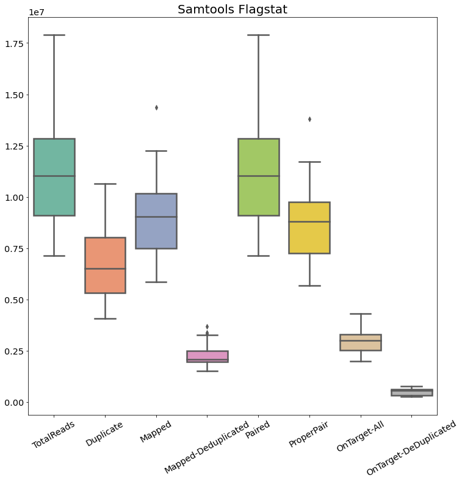

# MethodsTBS

Targeted Bisulfite Sequencing for Biomarker Discovery

## Processing Scripts

- Scripts for processing targeted bisuflite sequencing data written for use with SGE cluster environment
  - Adapter Trimming
  - Indexing
  - Read alignment
  - Methylation Calling

## Analysis Notebooks

- Jupyter notebook describing
  - Quality Control Pipeline
  - Fitting Epigenetic Clock Using Targeted Bisulfite Sequencing Data

## Targeted Bisulfite Sequencing QC

The code to produce the following graphs is contained in the QC jupyter notebook. The goal of the QC analysis is to
assess alignment performance by looking at general alignment statistics, the number of reads mapping to regions
targeted by probes, and the observed duplication rate.

### Alignment Stats

We can start assessing alignment quality by looking at the output logs generated by the alignment tool
[BSBolt](https://bsbolt.readthedocs.io/en/latest/). The alignment log give information on the total number of read pairs
observed, the bisulfite strand where reads mapped, and the number of unmapped / bisulfite ambiguous single reads. The
mappability is calculated as $mappability = 2 * total read pairs - unmapped reads$.

Using *samtools flagstat* we can investigate the alignment file by looking at the sam flags set for each read. Sam flags
are bitwise combination of different alignment attributes.

Using *bedtools multicov* we will investigate the average number of reads that map to the targeted regions. The coverage
shown is plotted for all mapped reads and mapped reads with duplicates removed.

